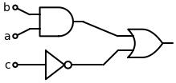
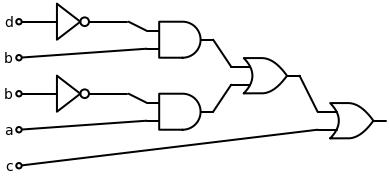
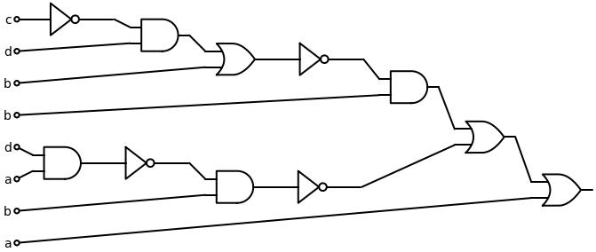

# LogicCircuitDrawer
Takes a logical expression from user and draws a logic circuit in an image

## Dependencies:
```
1- sympy==1.13.3
2- schemdraw==0.19
3- matplotlib==3.10.0
```
**To install the required dependencies:**<br>
download the ```requirements.txt``` file, then run the following command
```
pip install -r requirements.txt
```
## Examples:
**The syntax/format for input (AND = &, OR = |, NOT = ~), those are the only gates used currently.**<br>
1. <br>
Logical Expression: 'a & b | ~c'<br><br>
2. <br>
Logical Expression: 'c | (~b & a) | (~d & b)'<br><br>
3. <br>
Logical Expression: 'a | ~(b & ~(a & d)) | (b & ~(b | (d & ~c)))'<br><br>

## Setting up Conda Env.:
### Prerequisites:
- Install ```MiniConda``` or ```Anaconda```
    - MiniConda installation: [Miniconda Installation Guide](https://docs.conda.io/en/latest/miniconda.html)
    - Anaconda installation: [Anaconda Installation Guide](https://www.anaconda.com/products/distribution)
    - Works on **Windows**, **Linux** or **MacOS**.
### Setting up the environment:
1. Create conda environment:
   ```bash
   conda create --name env_name python=python_version
   ```
   ```env_name``` -> your environment name (eg. ```project_env```)<br>
   ```python_version``` -> your used python version in the environment (eg. ```python=3.12```)<br><br>
2. Activate environment:
   ```bash
   conda activate env_name
   ```
   ```env_name``` -> your environment name (eg. ```project_env```)<br><br>
3. Install required python packages:
   ```bash
   conda install package_name(s)
   ```
   For example:
     ```bash
     conda install sympy schemdraw matplotlib
     ```
   or anlternatively, use the ```requirements.txt```:<br><br>
     ```bash
     pip install -r requirements.txt
     ```
     <br><br>
4. Run the python code:
   ```bash
   python script_name.py
   ```
   ```script_name.py``` -> python script name (eg. ```main.py```)<br><br>
5. Deactivate Environment:
   ```bash
   conda deactivate
   ```
